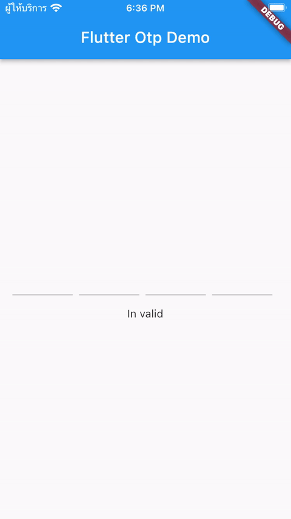

# OTP Widget

## Feature

- Auto Select
- continue input autoreplace current
- backspace support

<p align="center">

</p>

# Install

```yml
dependencies:
  flutter:
    sdk: flutter

  carousel_pro:
    git:
      url: git://github.com/mengxyz/otp_widget.git
      ref: main # branch name
```

# Import class

```dart
import 'package:otp_widget/otp_widget.dart';
```

# Example full code

```dart
import 'package:flutter/material.dart';
import 'package:otp_widget/otp_widget.dart';

void main() {
  runApp(const MyApp());
}

class MyApp extends StatelessWidget {
  const MyApp({Key? key}) : super(key: key);

  @override
  Widget build(BuildContext context) {
    return MaterialApp(
      title: 'Flutter Otp Widget Demo',
      theme: ThemeData(
        primarySwatch: Colors.blue,
      ),
      home: const MyHomePage(title: 'Flutter Otp Demo'),
    );
  }
}

class MyHomePage extends StatefulWidget {
  const MyHomePage({Key? key, required this.title}) : super(key: key);
  final String title;
  @override
  State<MyHomePage> createState() => _MyHomePageState();
}

class _MyHomePageState extends State<MyHomePage> {
  final GlobalKey<OtpWidgetState> state = GlobalKey();
  @override
  Widget build(BuildContext context) {
    return Scaffold(
      appBar: AppBar(
        title: Text(widget.title),
      ),
      body: Center(
        child: Column(
          mainAxisAlignment: MainAxisAlignment.center,
          children: <Widget>[
            OtpWidget(
              key: state,
              obscureText: false,
              lenght: 4,
              onChange: (v) => setState(() {}),
            ),
            const SizedBox.square(dimension: 16),
            state.currentState?.isValid == true
                ? Text("Valid")
                : Text("In valid")
          ],
        ),
      ),
    );
  }
}
```

## Validate and Get value

```dart
  final GlobalKey<OtpWidgetState> state = GlobalKey();

  // Get value
  state.currentState.text

  // Validate 
  state.currentState.lenght
```